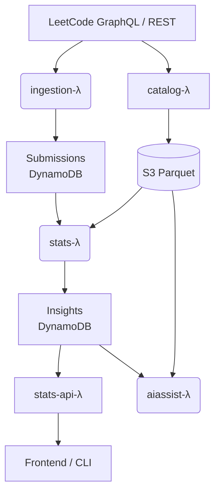

# LeetSync

**LeetSync** is a fully serverless, test‑driven analytics pipeline that keeps your LeetCode progress in sync, rolls up daily statistics, and serves AI‑powered recommendations – all for pennies per month.

---

## ✨ Features

| Layer | Capability |
|-------|------------|
| **Ingestion** | `ingestion‑lambda` polls recent AC submissions every 15 minutes and persists to DynamoDB |
| **Problem Catalog** | `problem‑lambda` (weekly) fetches the full problem list, enriches new slugs with topic tags & AC‑rate, and stores partitioned Parquet in S3 |
| **Data Lake** | Amazon S3 bucket with `year=/month=/week=` partitions; queryable by Athena/Glue |
| **Roll‑ups** | `stats‑lambda` (nightly) joins submissions + catalog and writes one TTL row/day to an **Insights** table |
| **API** | `stats‑api‑lambda` exposes `/stats` JSON endpoints |
| **AI Assist** | `aiassist‑lambda` feeds Insights + catalog into Amazon Bedrock to recommend next problems |
| **Infra** | AWS CDK (Java) provisions Lambda, DynamoDB, S3, EventBridge, IAM |
| **CI/CD** | GitHub Actions builds, tests, and deploys via CDK |
| **Observability** | OpenTelemetry traces, CloudWatch dashboards, project‑tagged cost explorer |

---

## 🏗️ Architecture



---

## 🗂️ Data Model

### `Problems` table
| PK | Fields |
|----|--------|
| `titleSlug` | `difficulty`, `totalAcceptedRaw`, `totalSubmissionRaw`, `acRate`, `frequency`, `topicTags[]` |

### `AcSubmissions` table
| PK | Fields |
|----|--------|
| `titleSlug` (PK) | `timestamp` (SK) | `title` |

### `Insights` table
| PK (`date`) | Fields |
|-------------|--------|
| `YYYY-MM-DD` | `easySolved`, `mediumSolved`, `hardSolved`, `totalSolved`, `tagsSolved{}`, `currentStreak`, `longestStreak`, `expiresAt` |

---

## 🚀 Quick Start

```bash
# 1. Bootstrap
cdk bootstrap aws://<account>/<region>

# 2. Build
mvn clean package

# 3. Deploy
cd infrastructure
cdk deploy LeetSyncDataStack
cdk deploy LeetSyncIngestionStack
cdk deploy LeetSyncProblemStack
cdk deploy LeetSyncApiStack
```

Verify:
* CloudWatch shows successful ingestion invocations.
* DynamoDB tables contain rows.
* Hitting the API Gateway endpoint `/acsubmissions` returns JSON.

---

## 💸 Cost Snapshot (single user, us‑west‑2)

| Source | Monthly USD |
|--------|-------------|
| Lambda compute | ~0.05 |
| DynamoDB on‑demand | ~0.01 |
| S3 storage | ~0.002 |
| **Total** | **≈ $0.06** |

---

## 🗺️ Roadmap

- [x] Ingestion & REST API
- [x] Problem catalog with weekly Parquet
- [ ] Nightly stats‑λ roll‑up
- [ ] `/stats` API λ
- [ ] aiassist‑λ with Bedrock + cache
- [ ] GitHub Actions CI/CD
- [ ] OpenTelemetry traces & dashboards
- [ ] Public demo frontend

---

## 📝 License

MIT © 2025 Xiwen Han
